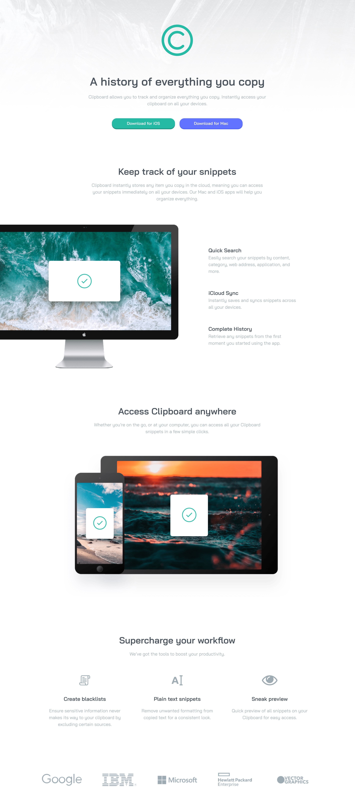

# Frontend Mentor - Clipboard landing page solution

This is a solution to the [Clipboard landing page challenge on Frontend Mentor](https://www.frontendmentor.io/challenges/clipboard-landing-page-5cc9bccd6c4c91111378ecb9). Frontend Mentor challenges help you improve your coding skills by building realistic projects. 

## Table of contents

- [Overview](#overview)
  - [The challenge](#the-challenge)
  - [Screenshot](#screenshot)
  - [Links](#links)
- [My process](#my-process)
  - [Built with](#built-with)
  - [What I learned](#what-i-learned)
  - [Useful resources](#useful-resources)
- [Author](#author)

**Note: Delete this note and update the table of contents based on what sections you keep.**

## Overview

### The challenge

Users should be able to:

- View the optimal layout for the site depending on their device's screen size
- See hover states for all interactive elements on the page

### Screenshot



### Links

- Solution URL: [Add solution URL here](https://your-solution-url.com)
- Live Site URL: [Add live site URL here](https://your-live-site-url.com)

## My process

Used this project to put in pratice all the content from the 1st part of the Codecademy course related to HTML, CSS, Responsive.

### Built with

- Semantic HTML5 markup
- CSS custom properties
- Flexbox
- CSS Grid
- Mobile-first workflow

**Note: These are just examples. Delete this note and replace the list above with your own choices**

### What I learned

Learned how to use background gradient opacity from top to bottom.

```css
header {
    background-image: linear-gradient(to bottom, rgba(255, 255, 255, 0), rgba(255, 255, 255, 1)), url('./images/bg-header-mobile.png');
}
```

Learned how to use box-shadow.

```css
.btn-cyan-color {
    background-color: var(--clr-prim-cyan);
    box-shadow: 0 0.2em hsl(171, 66%, 34%);
}

.btn-blue-color {
    background-color: var(--clr-prim-light-blue);
    box-shadow: 0 0.2em hsl(233, 100%, 65%);
}
```

Learned about properties of buttons such as :hover and :active

```css
.btn-cyan-color:hover {
  background-color: hsl(171, 66%, 54%);
}

.btn-blue-color:hover {
  background-color:  hsl(233, 100%, 79%);
}

.btn-cyan-color:active {
  background-color: var(--clr-prim-cyan);
  box-shadow: none;
}

.btn-blue-color:active {
  background-color:  var(--clr-prim-light-blue);
  box-shadow: none;
}
```

### Useful resources

- [CSS Box-Shadow tutorial: the basics](https://www.youtube.com/watch?v=-JNRQ5HjNeI) - This video helped me understand how box-shadow propertie works.

## Author

- Website - [Alexandre Morgado](https://github.com/Almopt)
- Frontend Mentor - [@Almopt](https://www.frontendmentor.io/profile/Almopt)
- Twitter - [@Almo_pt](https://www.twitter.com/Almo_pt)

